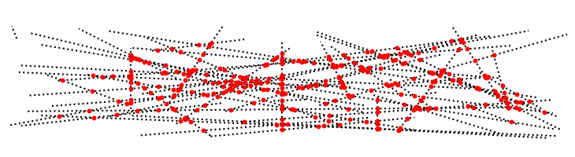

# SweepIntersectorLib



_SweepIntersectorLib_ is an implementation in pure Python of a sweep line algorithm for line-segment intersection, based on the algorithm described in the paper:

[Mehlhorn, K., Näher, S.(1994).<br>Implementation of a sweep line algorithm
for the Straight Line Segment Intersection Problem (MPI-I-94-160).
Saarbrücken: Max-Planck-Institut für Informatik.](https://pure.mpg.de/pubman/faces/ViewItemOverviewPage.jsp?itemId=item_1834220)

Given a list of line segments in 2D, the algorithm finds all their pairwise intersections. In contrast to the classical [Bentely-Ottmann](https://en.wikipedia.org/wiki/Bentley%E2%80%93Ottmann_algorithm) algorithm, segments are allowed to be vertical, several segments may intersect in the same point, endpoints of segments my lie on other segments or may be common with their endpoints.

## Demo
The demo uses the _matplotlib_ library to visualize the results.
Install it first:
```
pip install matplotlib
```
Then run the demo:
```
cd /path/to/sweep_intersector
python demo.py
```

## Usage
The whole work is done by the method `findIntersections()` of the class `SweepIntersector`:

```Python
    intSector = SweepIntersector()
    isectDic = intSector.findIntersections(segList)
```
The segment list `segList` is a Python `list` of tuples `(vs,ve)`, where `vs` is the start point and `ve` the end point of a segment. The points `vs` and `ve` are given as tuples `(x,y)?  where `x` and `y?  are their coordinates in the 2D plane. 

The method returns a dictionary `isectDic` with items `seg:isects` for all segments that had intersections. The key of the dictionary, `seg`, is a tuple `(vs,ve)` identical to the one in the input list and the value `isects` is a list of all intersections of the segment `seg`. These are given  as tuples `(x,y)`, where again `x` and `y` are their coordinates in the 2D plane. This list includes the start and end points `vs` and `ve` and is ordered from `vs` to `ve`.

### Usage example:
```Python
    from SweepIntersectorLib.SweepIntersector import SweepIntersector

    segList = []
    segList.append( ((1.0,1.0),(5.0,6.0)) )
    segList.append( ((1.0,4.0),(4.0,0.0)) )
    segList.append( ((1.5,5.0),(3.0,1.0)) )
    ...

    isector = SweepIntersector()
    isectDic = isector.findIntersections(segList)
    for seg,isects in isectDic.items():
        for p in isects[1:-1]:  # here without end points
            plotInterxectionPoint(p)
```
